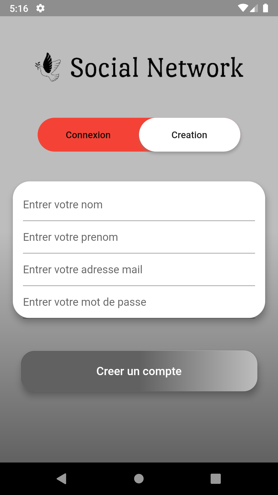
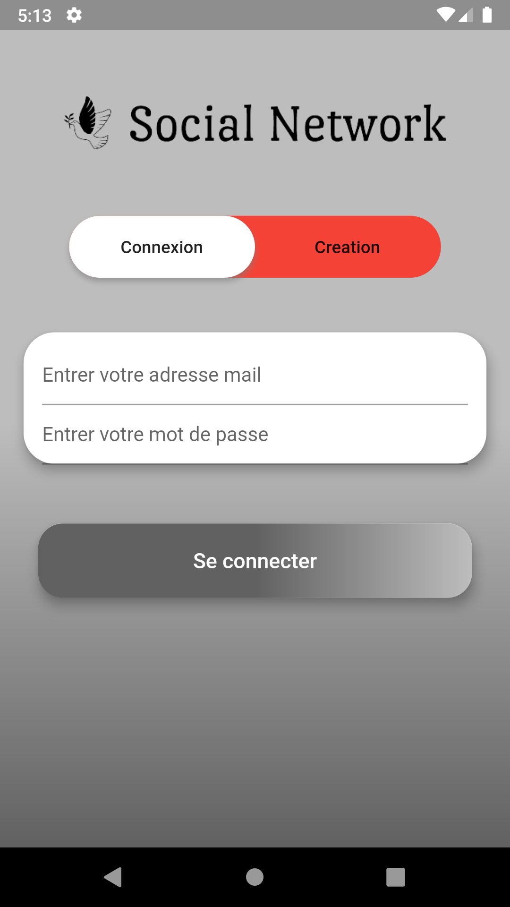

# flutter_social_network_app

Social network app for iOS and Android with flutter_bloc to implement login and posting using Firebase.

## 1. Sign up  
<table>
    <tr>
        <td>Lesson Goals</td>
        <td><a href="https://www.youtube.com/watch?v=liEGSeD3Zt8">Learn more about Stack</a></td>
    </tr>
      <tr>
        <td>
        description 
            1. How to init the firebase?  
            2. How to draw a CustomPainter?   
             /****************************************************************************/ 
        </td>      
        <td>
            
        </td>
      </tr>
</table>

## 2. Sign in 
<table>
    <tr>
        <td>Lesson Goals</td>
        <td><a href="https://www.youtube.com/watch?v=liEGSeD3Zt8">Learn more about Stack</a></td>
    </tr>
      <tr>
        <td>
        description 
          1.  
          2.    
         /**********************************************************************************/
        </td>
        <td></td>
      </tr>
</table>

## Posting bloc

- Add post page using firestore and storage
- Add profile page 
- Add user page with many users
- Add news page
- Add Notify page

## Getting Started

### iOS

1. Replace ./ios/Runner/GoogleService-Info.plist with your own
2. Update ./ios/Runner/info.plist
    - Paste the REVERSED_CLIENT_ID from GoogleService-Info.plist to key CFBundleURLSchemes in info.plist

### Android

1. Replace ./android/app/google-services.json with your own
2. Update ./android/app/build.gradle
    - Replace "com.example.flutter_firebase_login" with the package_name from google-services.json

## Run the Project 

1. flutter run

